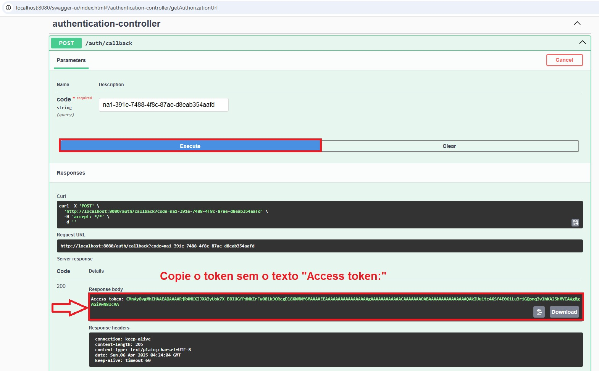

# Projeto de gerenciamento de contatos

Este projeto tem como objetivo realizar o gerenciamento de contatos. Por enquanto ele só realiza a criação de contatos via API do Hubspot.
Abaixo você encontrará as instruções necessárias para configurar o ambiente de desenvolvimento e rodar o projeto, incluindo a execução de testes.

## Requisitos

Antes de começar, você precisará de:

* Java 17 (ou superior)
* Maven (para gerenciar dependências e executar o projeto)
* IDE recomendada: IntelliJ IDEA (mas outras IDEs também funcionam)
* Conta e chave de API HubSpot

## Como Configurar o Projeto

### 1. Clonando o Repositório

Primeiro, clone o repositório do projeto para o seu ambiente local:

`git clone https://github.com/ErikKenzoValle/contacts-manager.git
`

`cd contacts-manager
`

### 2. Configurando o Ambiente
   Se você estiver usando IntelliJ IDEA, basta abrir o projeto na IDE.

Caso não tenha o IntelliJ IDEA:

Faça o download e instale a versão mais recente do [IntelliJ IDEA](https://www.jetbrains.com/idea/download/).

Abra o IntelliJ IDEA e selecione "Open" e escolha o diretório do projeto.

### 3. Configurando Dependências
   As dependências podem ser baixadas automaticamente ao abrir o projeto no IntelliJ IDEA, ou você pode rodar o seguinte comando no terminal:

`
mvn clean install
`

## Como Rodar o Projeto

### 1. Executando o Projeto

   Com as dependências configuradas, você pode rodar o projeto da seguinte maneira:

Dentro do IntelliJ IDEA, você pode simplesmente rodar a classe principal, que está em `src/main/java/com/erik/contactsmanager/ContactsManagerApplication.java`. Você pode clicar com o botão direito e escolher a opção Run 'ContactsManagerApplication', é um botão play verde.

Ou pelo terminal:

`mvn spring-boot:run`

### 2. Acessar o Swagger
Para testar os endpoints, acesse o Swagger, uma interface de fácil uso, através do link: http://localhost:8080/swagger-ui/index.html

IMPORTANTE: o endpoint de criação de contatos não funciona no Swagger por causa do RequestHeader, utilize outra ferramenta para testar, como Postman ou no próprio terminal com o CURL.

## Como Rodar os Testes

   Para rodar os testes unitários, você pode usar o Maven diretamente pela IDE ou pelo terminal:

#### Pelo IntelliJ IDEA: 

Clique com o botão direito na pasta `src/test/java` e selecione Run 'All Tests'.

#### Pelo terminal:

Rodar todos os testes do projeto:

`mvn test`

Ou para rodar um teste específico:

`mvn -Dtest=NomeDaClasseTeste test`

## Documentação Técnica

### Endpoints

1. GET /auth/url

Este endpoint é a primeira etapa da autenticação, ele monta e retorna a URL de autorização para iniciar o fluxo OAuth com o HubSpot.

Abaixo segue um exemplo de como testá-lo:

O endpoint utiliza 3 variáveis configuradas no microsserviço para gerar a URL. Caso qualquer uma delas esteja vazia, será retornado erro `status 500: Não é possível gerar a URL de autenticação sem todos os campos internos necessários!`

Com a URL gerada no endpoint anterior, você deverá acessá-la, se autenticar no Hubspot e copiar o `code` gerado, que será usado no próximo endpoint, conforme a imagem:

2. POST /auth/callback

Este endpoint é responsável por gerar o token de acesso para os endpoints da Hubspot, como o de criação de contato. 

Com o código gerado no endpoint anterior, você deverá passá-lo como parâmetro. Ele irá gerar o access token para você conseguir se autenticar com os endpoints da Hubspot.

Este endpoint pode retornar 3 possíveis erros, devidamente mapeados:
- Caso exceda o rate limit, que é a quantidade de requisições por segundo da API da Hubspot;
- Caso a API do Hubspot retorne qualquer outro erro;
- Caso este endpoint dê qualquer problema no processamento, como conversão de objetos por exemplo.

3. POST /v1/contacts

Este é o endpoint de criação de contato, responsável por gerar um contato na API da Hubspot. No Swagger você encontra um exemplo do Request body, e o endpoint não permite a criação de mais de um contato idêntico.
Para testá-lo, é só passar o token gerado no endpoint anterior como um Header "Authorization", e passar o request body, conforme o exemplo abaixo.

IMPORTANTE: este endpoint não funciona no Swagger porque o RequestHeader dá erro lá, por isso aconselho usar outra ferramenta como Postman ou o próprio terminal mesmo, através do CURL.

4. POST /v1/webhooks/contact-creation

Este endpoint escuta e loga o email dos contatos que foram criados e enviados através do webhook gerado pelo Hubspot, conforme a imagem abaixo: 

O domínio está como "exemplo.com" porque não permite usar "localhost", e como não temos nenhum domínio, foi colocado esse como teste por hora. O ideal seria ter o domínio certo, assim o endpoint conseguirá recebe os eventos do webhook, já que teria a URL de destino configurada conforme este endpoint. Abaixo segue uma imagem da estrutura do endpoint: 

### Dependências

Foram utilizadas algumas dependências/libs extras para deixar o código e o microsserviço mais organizado e mais limpo.
- lombok: para otimizar o código, evitando criação repetitiva de construtores, getters, setters, e facilitando no uso de logs.
- springdoc-openapi-starter-webmvc-ui: para ter a interface do Swagger
- jackson-databind: para converter o objeto/corpo retornado pela API da Hubspot para o retorno do endpoint.
- spring-boot-starter-validation: validação de campos de Request

### Melhorias Futuras
1. Adicionar novos endpoints de Contatos, para consulta, alteração e deleção caso exista;
2. Adicionar as informações do client-id e client-secret em um vault/cofre, para tornar as informações sensíveis protegidas;
3. Usar um FeignClient para os endpoints externos da Hubspot, substituindo o uso do RestTemplate;
4. Usar um ErrorDecoder para os endpoints externos, separando a responsabilidade concentrada no Usecase hoje;
5. Mapear se existe algum limite de tamanho para os campos de request da API da Hubspot;
6. Adicionar testes de integração, e resolver o mock do RestTemplate no teste da classe CreateContractTest;
7. Caso sejam adicionadas novas integrações com APIs de outras empresas, pensar em como adaptar e nomear as classes e os pacotes, separando domínios diferentes;
8. Passar esta documentação técnica para um outro documento separado, tornando mais fácil a organização das informações.

